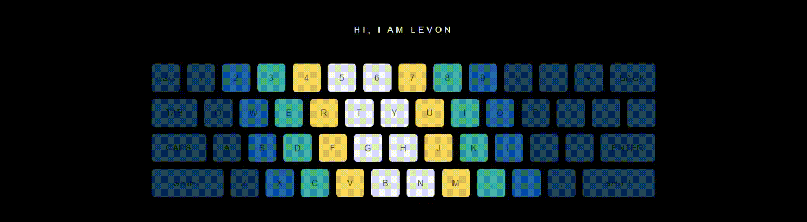

  

<h3>
👨‍💻 Levon Harutyunyan | 👨‍🎓 ⏳ Loading Master of Science in Information Technology |  
💻 Scraping and Back End Developer | 🌍 Yerevan, Armenia
</h3>

### Nerdy quote of the day

<!--
**Levon-98/Levon-98** is a ✨ _special_ ✨ repository because its `README.md` (this file) appears on your GitHub profile.

Here are some ideas to get you started:

- 🔭 I’m currently working on ...
- 🌱 I’m currently learning ...
- 👯 I’m looking to collaborate on ...
- 🤔 I’m looking for help with ...
- 💬 Ask me about ...
- 📫 How to reach me: ...
- 😄 Pronouns: ...
- ⚡ Fun fact: ...
-->
